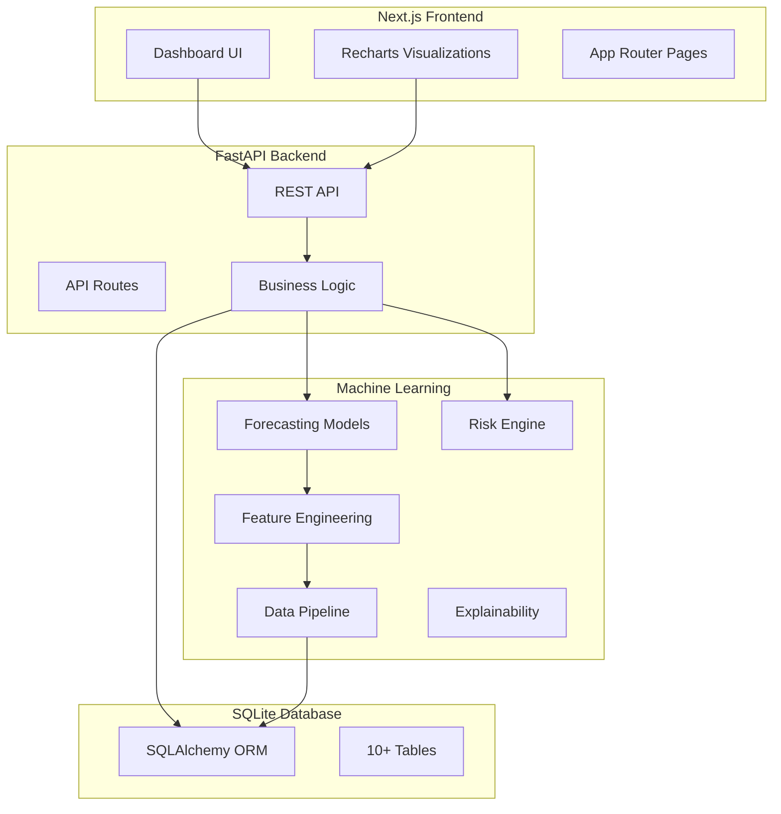

# PriceShock

> **"Know which prices may rise before they do."**

A locally-running AI/ML-powered Product Price Forecasting & Inflation Early-Warning System.

## Features

- 📊 **Multi-Horizon Forecasting** - 7, 30, 90, and 180-day price predictions
- 🤖 **Multiple ML Models** - ARIMA, Random Forest, Gradient Boosting with automatic model selection
- ⚠️ **Price Rise Risk Engine** - Calculates probability of significant price increases
- 📈 **Historical Analysis** - Track price trends with interactive charts
- 🔍 **Explainable AI** - Understand why predictions are made (SHAP-based explanations)
- 🏆 **Model Comparison** - Compare multiple forecasting models side-by-side
- 💾 **Local-First** - Works completely offline after setup
- 📱 **Professional Dashboard** - Financial intelligence-grade UI

## Quick Start

### Prerequisites

- Node.js 18+ and npm
- Python 3.9+
- pip

### Installation

**Windows:**
```bash
start.bat
```

**macOS/Linux:**
```bash
chmod +x start.sh
./start.sh
```

### Manual Setup

1. **Install Backend Dependencies:**
```bash
cd backend
python -m venv venv
# Windows: venv\Scripts\activate
# macOS/Linux: source venv/bin/activate
pip install -r requirements.txt
```

2. **Install Frontend Dependencies:**
```bash
cd frontend
npm install
```

3. **Generate Demo Data and Train Models:**
```bash
cd ml
python generate_demo_data.py
python train.py
```

4. **Start Backend:**
```bash
cd backend
uvicorn app.main:app --reload --port 8000
```

5. **Start Frontend (in a new terminal):**
```bash
cd frontend
npm run dev
```

6. **Open Browser:**
Navigate to `http://localhost:3000`

## Architecture



## Supported Products

### Food
- Rice, Wheat, Sugar, Milk, Cooking Oil, Tomato, Onion, Potato

### Energy
- Petrol, Diesel, Crude Oil

### Construction
- Cement, Steel

## Data Strategy

The application uses **synthetic demo data** labeled clearly as "Demo / Synthetic Data" for demonstration purposes. The architecture supports:

1. Local CSV data (default)
2. MoSPI CPI API (optional, requires API key)
3. Commodity price APIs (optional)
4. Future data providers

**No external API keys are required.** The application works completely offline.

## Forecasting Models

1. **Naive Baseline** - Simple persistence model
2. **Seasonal Naive** - Seasonal pattern persistence
3. **ARIMA/SARIMA** - Statistical time series model
4. **Random Forest** - Ensemble tree-based model
5. **Gradient Boosting** - Advanced ensemble method

Models are evaluated using chronological walk-forward validation. The best performing model is automatically selected.

## Risk Engine

Calculates probability of price increases over selected horizons:
- 5% increase probability
- 10% increase probability
- 20% increase probability

Risk levels: LOW, MODERATE, HIGH, SEVERE

## Important Notes

### Synthetic Data Disclaimer
All demo data is **synthetic** and labeled as such. It is NOT real market data and should not be used for actual trading or financial decisions.

### Forecast Accuracy
- Forecasts are probabilistic estimates, not guarantees
- Accuracy varies by product and horizon
- Longer horizons have higher uncertainty
- Always consider multiple sources before making decisions

### Not Financial Advice
This is a forecasting/decision-support tool. It does NOT provide guaranteed financial advice.

## Tech Stack

**Frontend:**
- Next.js 14 (App Router)
- TypeScript
- Tailwind CSS
- shadcn/ui
- Recharts
- Lucide Icons

**Backend:**
- Python 3.9+
- FastAPI
- Pydantic
- SQLAlchemy

**Machine Learning:**
- pandas
- numpy
- scikit-learn
- statsmodels
- joblib
- SHAP (optional)

**Database:**
- SQLite

## Project Structure

```
priceshock/
├── frontend/          # Next.js application
│   ├── app/          # App router pages
│   ├── components/   # React components
│   └── lib/          # Utilities
├── backend/          # FastAPI server
│   ├── app/
│   │   ├── main.py
│   │   ├── models/   # SQLAlchemy models
│   │   ├── routes/   # API endpoints
│   │   ├── services/ # Business logic
│   │   └── schemas/  # Pydantic schemas
│   └── requirements.txt
├── ml/               # Machine learning
│   ├── data/         # Datasets
│   ├── models/       # Trained models
│   ├── forecasting/  # Forecasting logic
│   ├── features/     # Feature engineering
│   ├── evaluation/   # Model evaluation
│   ├── generate_demo_data.py
│   └── train.py
├── scripts/          # Utility scripts
├── docs/             # Documentation
├── start.bat         # Windows startup
└── start.sh          # macOS/Linux startup
```

## API Documentation

Once the backend is running, visit:
- API Docs: `http://localhost:8000/docs`
- ReDoc: `http://localhost:8000/redoc`

## License

MIT

## Disclaimer

This project is for educational and demonstration purposes only. Synthetic data is used for all examples. This is NOT financial advice.